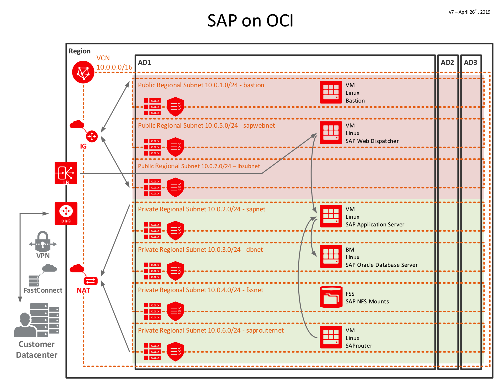

# oci-sap-dev
These are Terraform modules to prepare infrastructure and resources for deploying Oracle Database based SAP apps on Oracle Cloud Infrastructure(OCI).

## Terraform Provider for Oracle Cloud Infrastructure
The OCI Terraform Provider is now available for automatic download through the Terraform Provider Registry. 
For more information on how to get started view the [documentation](https://www.terraform.io/docs/providers/oci/index.html) 
and [setup guide](https://www.terraform.io/docs/providers/oci/guides/version-3-upgrade.html).

* [Documentation](https://www.terraform.io/docs/providers/oci/index.html)
* [OCI forums](https://cloudcustomerconnect.oracle.com/resources/9c8fa8f96f/summary)
* [Github issues](https://github.com/terraform-providers/terraform-provider-oci/issues)
* [Troubleshooting](https://www.terraform.io/docs/providers/oci/guides/guides/troubleshooting.html)

## Clone the Module
Now, you'll want a local copy of this repo. You can make that with the commands:

    git clone https://github.com/oracle/oci-sap-dev.git
    cd oci-sap-dev
    ls

## Deploy on single-AD
Pick single-ad deployment typing `cd single-ad`. You can deploy with the following Terraform commands:

    terraform init
    terraform plan
    terraform apply

When complete, Terraform will print information on how you can access the deployment.

## Destroy the Deployment
When you no longer need the deployment, you can run this command to destroy it:

    terraform destroy

## SAP on OCI - Three Tier Architecture

These are Terraform modules for deploying a basic Infrastructure to support SAP on Oracle Cloud Infrastructure (OCI):

* [single-ad](single-ad) deploys all infrastructure on a single availability domain. This is a good fit for people who want to explore SAP on OCI.
  
## Prerequisites
First off, you'll need to do some pre-deploy setup.  That's all detailed [here](https://github.com/cloud-partners/oci-prerequisites).

Secondly, customize the SAP on OCI terraform stack based on your requirements like:

* Define the compartment where the resources will be created by setting the compartment_ocid into terraform.tfvars file
`compartment_ocid ="<compartment OCID>"`
* Bastion Server VNC Password will use the instance "Display Name" as the initial Password
* If needed, open additional firewall Ports in the security-lists.tf file and add a `firewall-cmd` CLI into the script file for the node (i.e.; script-sap-bast.sh) where that port needs to be accessible (i.e.; `sudo firewall-cmd --zone=public --permanent --add-port=80/tcp`. The SAP Ports to be used for the communication between the various components can be found on the following official [SAP Website](https://help.sap.com/viewer/ports)
* Update `SAPSID` in the `script-sap-db.sh` script file to match your **SAP SID**
* Boot and Block volumes have a pre-defined size. Update variables.tf with the appropriate size information prior to provisioning the terraform stack
* SWAP file has been set to 96Gb which means SAP DB and APP instances SWAP size is going to be local 8Gb partition + 96Gb swap file. Update this accordingly

## Installation Process
[This document](http://www.oracle.com/us/solutions/sap/sap-netweaver-on-oracle-cloud-wp-3931430.pdf) describes the necessary steps to correctly configure Oracle Cloud Infrastructure Compute for the deployment of an SAP NetWeaver system, how to install an SAP NetWeaver system on Oracle Cloud Infrastructure and provides useful information on how to shift an on-premise SAP NetWeaver environment to Oracle Cloud Infrastructure  and to make an SAP NetWeaver system highly available on Oracle Cloud Infrastructure.
